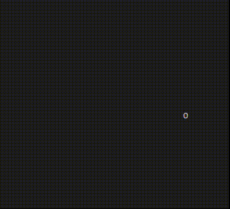

# Змейка в терминале, на C++
Вот так выглядит захватываюий геймплей  
(то что фон не полностью серый вина рекордера)  

## Запуск змейки:
### С помощью Docker:
Один раз делаем билд:
```
docker build -t ifan/snake .
```
И теперь запускаем змейку с помощью:
```
docker run -it ifan/snake
```
### С помощью apt:
Установка необходимых компонентов:
```
apt-get update
apt-get install gcc cmake build-essential libncurses5-dev
```
Создание билда:
```
cmake -S . -B ./build
cmake --build build
```
Запуск змейки:
```
./build/terminal_snake
```
